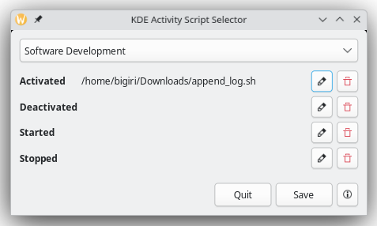

# KDE Activity Script Selector

[](https://github.com/BernardIgiri/kas-selector/actions/workflows/release.yml)

**KDE Activity Script Selector** is a [Relm4](https://github.com/Relm4/Relm4) base application that allows users to assign shell scripts to [KDE](https://kde.org/) Activity lifecycle events (e.g., `started`, `activated`, `deactivated`, `stopped`). It provides a simple graphical interface for managing these script bindings per activity and event.



👉 [Download Here](#-download)

## 🤩 Background & Motivation

KDE’s "Activity" feature is one of its most powerful but least known tools. It allows users to segment their workflows into distinct contexts (separate from virtual desktops) with different wallpapers, window rules, and app arrangements.

What’s even less known is that KDE supports **per-activity scripting**: you can run custom shell scripts when an activity is started, stopped, activated, or deactivated. However, this feature is not well undocumented and lacks any graphical interface for configuration.

**KDE Activity Script Selector** exists to make this hidden power accessible. It provides a clean UI for linking scripts to activity events, lowering the barrier to using Activities as a true automation and workflow engine in KDE.

## ✨ Features

* ✅ Automatically detects existing KDE activities.
* ✅ Supports assigning `.sh` scripts to each activity's life-cycle events.
* ✅ Displays activity names and events, not raw file paths.
* ✅ Handles validation, linking, and cleanup of associated script files.
* ✅ Supports multiple languages using [Project Fluent.](https://projectfluent.org/)
* ✅ Designed for KDE Plasma 6.

## ⚙️ Environment Variables

The following environment variables can be used to customize the behavior of the app:

| Variable                    | Description                                                                               | Default                                           |
| --------------------------- | ----------------------------------------------------------------------------------------- | ------------------------------------------------- |
| `KAS_ROOT`                  | Overrides the default root path where the script files are stored per activity and event. | `$HOME/.local/share/kactivitymanagerd/activities` |
| `KAS_SCRIPT_NAME`           | The filename of the script to assign (must be a valid `.sh` file).                        | `kas-script.sh`                                   |
| `LANGUAGE` or `LC_MESSAGES` | Used to determine the preferred UI language via Fluent localization system.               | System locale                                     |

## 💾 Download

Pre-built `.deb` packages are available on the [GitHub Releases page](https://github.com/BernardIgiri/kas-selector/releases/latest).

To install version `X` :

```bash
# Replace this with the version number (e.g. 0.3.1)
x=0.3.1

wget "https://github.com/BernardIgiri/kas-selector/releases/download/v${x}/kas-selector_${x}-1_amd64.deb"
sudo dpkg -i "kas-selector_${x}-1_amd64.deb"
```

**Run** `kas-selector`

## 🔨 Build Instructions

Ensure you have the following installed:

* [Rust (version 1.88 or later)](https://www.rust-lang.org/tools/install)
* [GTK4 development libraries](https://gtk-rs.org/gtk4-rs/git/book/installation_linux.html)
* [cargo-nextest](https://nexte.st)

Then run:

```bash
cargo build --release
```

## ▶️ Run

```bash
KAS_ROOT=/custom/path \
KAS_SCRIPT_NAME=startup.sh \
cargo run
```

## 📁 Directory Structure

Scripts are stored under:

```
~/.local/share/kactivitymanagerd/activities/<activity-id>/<event>/<script>
```

For example:

```
~/.local/share/kactivitymanagerd/activities/1234-uuid/activated/activity_script.sh
```

## 💡More KDE Tips

For more KDE Tips and Trick, especially with "Activities", checkout my blog post [Optimizing KDE Activities For Max Productivity!](https://yequalscode.com/posts/kde-productivity-tips)
